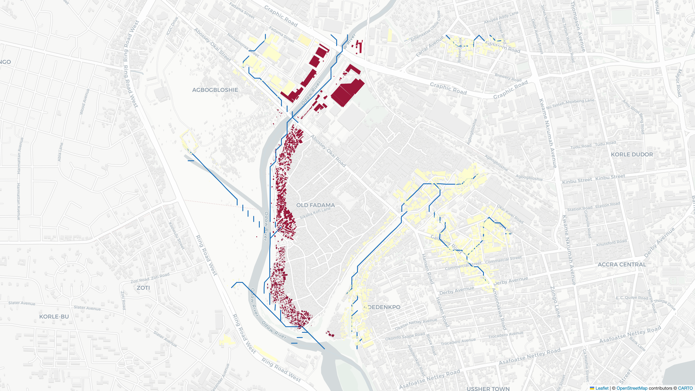
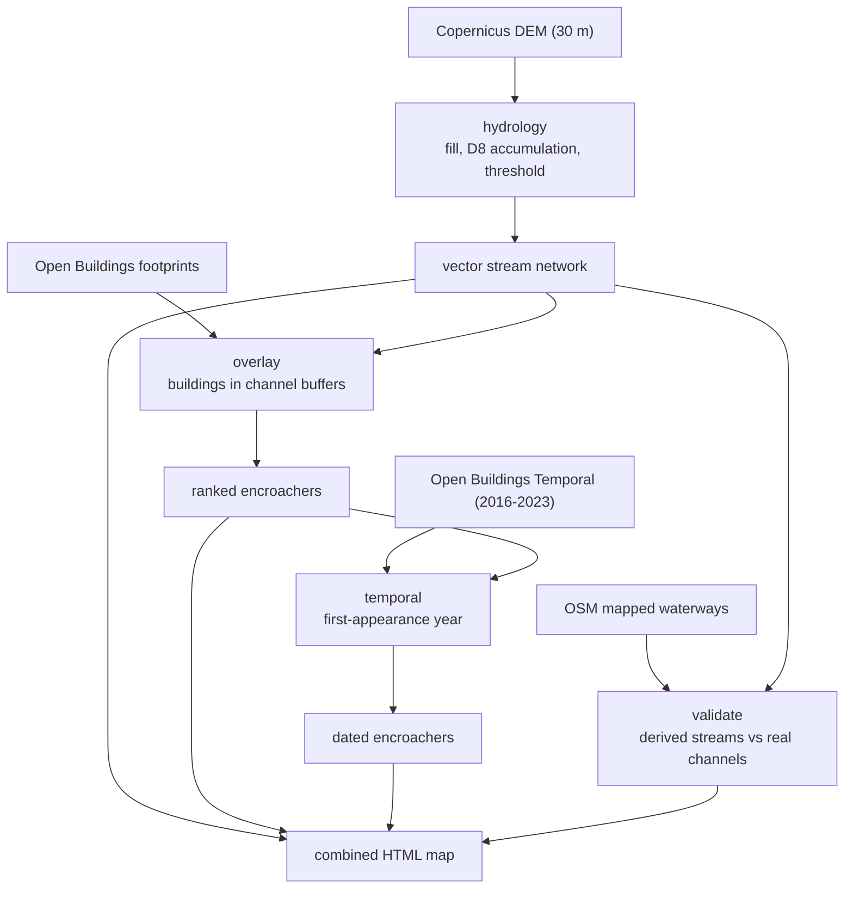
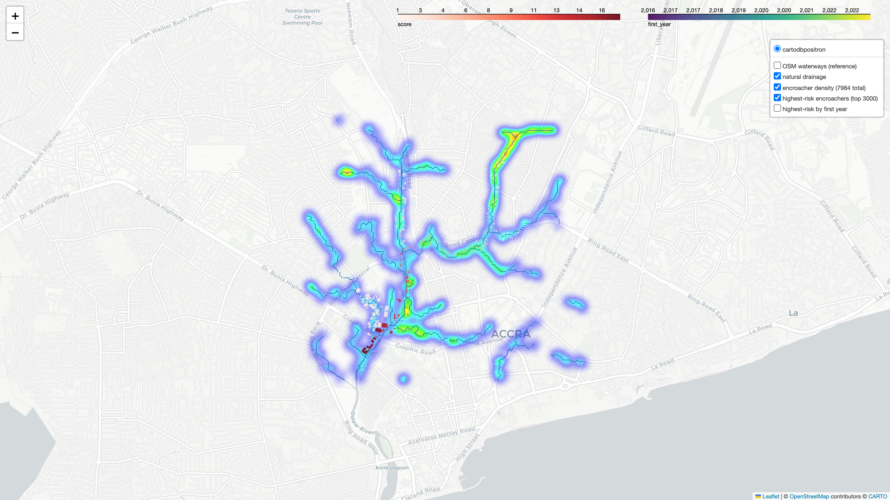

# accraflood

Terrain-derived drainage and building-encroachment detection for Accra, Ghana.



## The idea

Accra's flooding is pluvial: rain overwhelms drains that are clogged or paved over. The
underlying cause is governance, because buildings sit on natural watercourses. Rather than try
to map the (often undocumented) pipe network, we derive the natural drainage from terrain.

Water flow is a function of elevation, so standard hydrology on a Digital Elevation Model
recovers where water wants to go, even where a watercourse has been built over, because the
terrain still "remembers" the channel. Overlaying building footprints on those flow paths flags
encroachment. Differencing the footprints over time produces dated, geolocated records of when
each building appeared on the watercourse.

## Pipeline



## Data (all free, via Google Earth Engine and OpenStreetMap)

| Need | Source | Resolution |
|---|---|---|
| Terrain | `COPERNICUS/DEM/GLO30` | 30 m |
| Buildings | `GOOGLE/Research/open-buildings/v3/polygons` | polygon |
| Buildings over time | `GOOGLE/Research/open-buildings-temporal/v1` | annual 2016-2023 |
| Independent waterways (validation) | OpenStreetMap (Overpass) | vector |
| Sentinel-1 SAR (optional, deferred) | `COPERNICUS/S1_GRD` (VV, IW) | 10 m |

## Setup

```bash
# Create the conda env (conda-forge ships prebuilt GDAL, rasterio, geopandas)
conda env create -f environment.yml
conda activate accraflood
pip install -e .

# Authenticate Earth Engine. The gcloud flow is recommended (the default earthengine
# authenticate browser flow can be blocked by Google for some accounts):
gcloud auth application-default login
gcloud auth application-default set-quota-project <your-gcp-project-id>
export EARTHENGINE_PROJECT=<your-gcp-project-id>    # or set EE_PROJECT in config.py

# Confirm it works (runs a tiny Earth Engine round-trip)
accraflood auth
```

## Usage

```bash
accraflood fetch     --bbox-name odaw    # cache the DEM and Open Buildings for the bbox
accraflood drainage                      # derive and render the natural drainage network
accraflood overlay                       # flag and rank encroaching buildings
accraflood validate                      # derived streams vs OSM-mapped waterways
accraflood temporal                      # dated encroachment records
accraflood hotspots                      # cross-check vs documented Accra flood hotspots
accraflood run       --bbox-name odaw    # run everything into one combined HTML map
```

Each subcommand caches to `data/` and is independently runnable. Two bboxes are predefined:
`odaw` (a small, fast test area over the Odaw corridor) and `accra` (the whole metro, a much
heavier run).

The Sentinel-1 SAR check is wired but deferred (see Limitations):

```bash
accraflood validate --method sar --event-start 2026-06-28 --event-end 2026-07-06 --force
```

`accraflood run` produces one combined, toggleable HTML map: natural drainage, encroacher
density, and the highest-risk flagged buildings (coloured by score and by first-appearance year).



## How it is validated

There is no free observed flood-extent map for Accra's urban flooding, so we validate the model
two independent ways:

1. Against OpenStreetMap's mapped waterways. The derived streams hug the real mapped channels
   about 1.6x more than a random network would, and the main Odaw trunk is recovered.
2. Against Accra's documented flood hotspots (Circle, Alajo, Kaneshie, Avenor, and others).
   Those neighbourhoods carry a higher density of flagged encroachers than random locations.

## Limitations and ethics

- 30 m resolution is the binding constraint, and free data cannot beat it. The model catches
  major watercourse encroachment (the Odaw and big tributaries), not street-scale drains. We
  tested the principled alternatives (FABDEM bare-earth terrain, and re-imposing building
  footprints as barriers so flow routes down streets); on the OSM check they came out within
  noise of plain Copernicus, so the bottleneck is resolution, not terrain treatment. The
  default is Copernicus GLO-30; the FABDEM variant is one config flag away (research only, since
  FABDEM is CC BY-NC). Resolving street drains needs sub-5 m LiDAR or commercial stereo.
- "On a flow path" is not the same as "blocking". The channel buffer is a geometric proxy. The
  output ranks candidates; it does not adjudicate any individual building.
- Sentinel-1 SAR cannot reliably see Accra's urban floods (dense built-up areas defeat radar
  water detection). We confirmed this over ~100 archive scenes, and UNOSAT flag the same limit.
  So SAR is a deferred, best-effort check, not a cornerstone.
- Open Buildings Temporal ends around 2023, so it answers historical encroachment, not the most
  recent construction.
- This is a risk model, not ground truth. The building-level output has false positives at 30 m.
  Treat the aggregate statistics and the methodology as the shareable result; do not publish a
  map that accuses individual, named properties of illegal encroachment.

## Data sources and attribution

- Terrain: Copernicus DEM (ESA / European Commission).
- Buildings: Google Open Buildings (v3 and Temporal).
- Waterways: OpenStreetMap contributors, ODbL.
- SAR: Copernicus Sentinel-1 (ESA), via Google Earth Engine.
- Optional bare-earth terrain: FABDEM (Hawker et al.), CC BY-NC, off by default.
